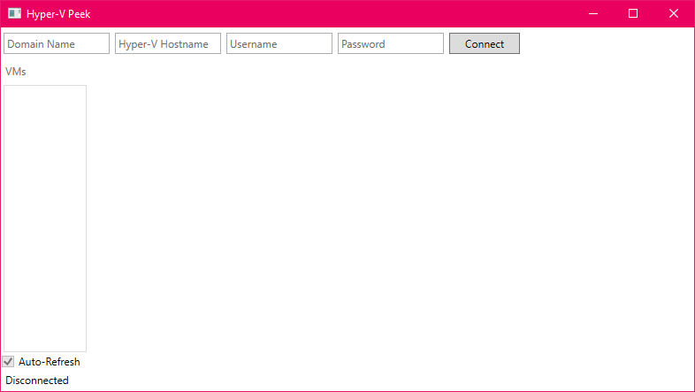

# 💠 Hyper-V Peek
A tiny utility that is used to connect to a Hyper-V Host, and grab preview images of virtual machines  running on it.

It was a quickly tossed together tool for my personal use, but perhaps you'll find it useful too!

Please excuse the rough edges.

## 🖼 Screenshot

*A two frame animated gif of Hyper-V Peek in the disconncted and connected states.*

## 📝 License
Hyper-V Peek is [licensed](./LICENSE) under the Zero-Clause BSD License (SPDX-License-Identifier: 0BSD). If you're interested in Hyper-V Peek under other terms, please contact the authors. Hyper-V Peek makes use of several open source packages. Those packages are each covered by their own copyrights and licenses, which are available via the tooling you use to restore the packages when building.

Copyright © 2023 [Chris March Dailey](https://cmd.wtf)

Permission to use, copy, modify, and/or distribute this software for any purpose with or without fee is hereby granted.

THE SOFTWARE IS PROVIDED "AS IS" AND THE AUTHOR DISCLAIMS ALL WARRANTIES WITH REGARD TO THIS SOFTWARE INCLUDING ALL IMPLIED WARRANTIES OF MERCHANTABILITY AND FITNESS. IN NO EVENT SHALL THE AUTHOR BE LIABLE FOR ANY SPECIAL, DIRECT, INDIRECT, OR CONSEQUENTIAL DAMAGES OR ANY DAMAGES WHATSOEVER RESULTING FROM LOSS OF USE, DATA OR PROFITS, WHETHER IN AN ACTION OF CONTRACT, NEGLIGENCE OR OTHER TORTIOUS ACTION, ARISING OUT OF OR IN CONNECTION WITH THE USE OR PERFORMANCE OF THIS SOFTWARE.
